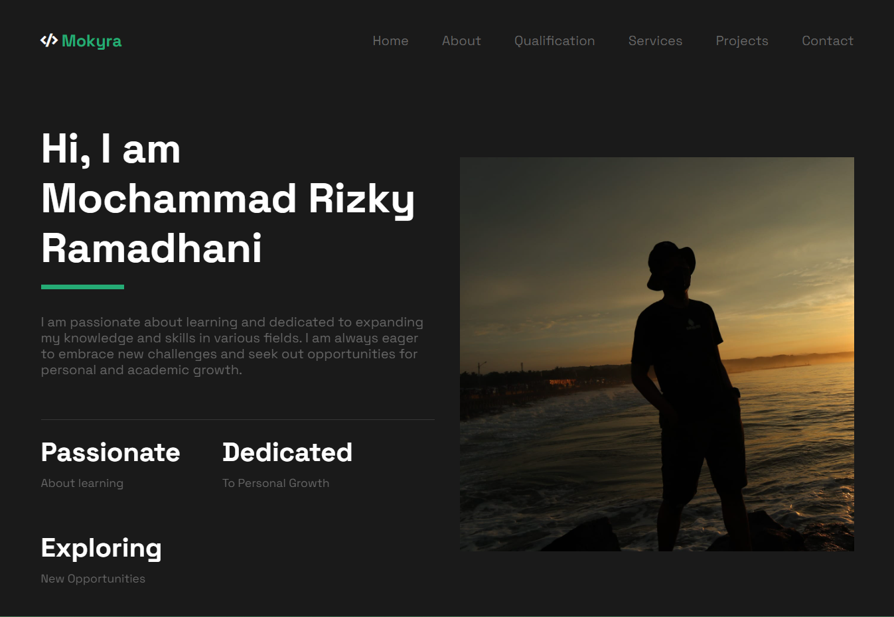

# Portofolio-Website

## Description
This repository contains the source code for my personal portfolio website. The website showcases my professional work, projects, and skills. It provides a brief overview of who I am and what I do, making it easier for potential employers, clients, or collaborators to get to know me.

## Preview


## Installation 
To set up your own portfolio website using this code: 

1. **Clone this repository to your local machine**.
   ```bash
   git clone https://github.com/yourusername/Portofolio-Website.git
   ```
   
2. Open the index.html file in your favorite code editor.
3. Customize the content, images, and links to match your personal portfolio information.
4. Save your changes and deploy the website to your hosting provider or platform of choice.
